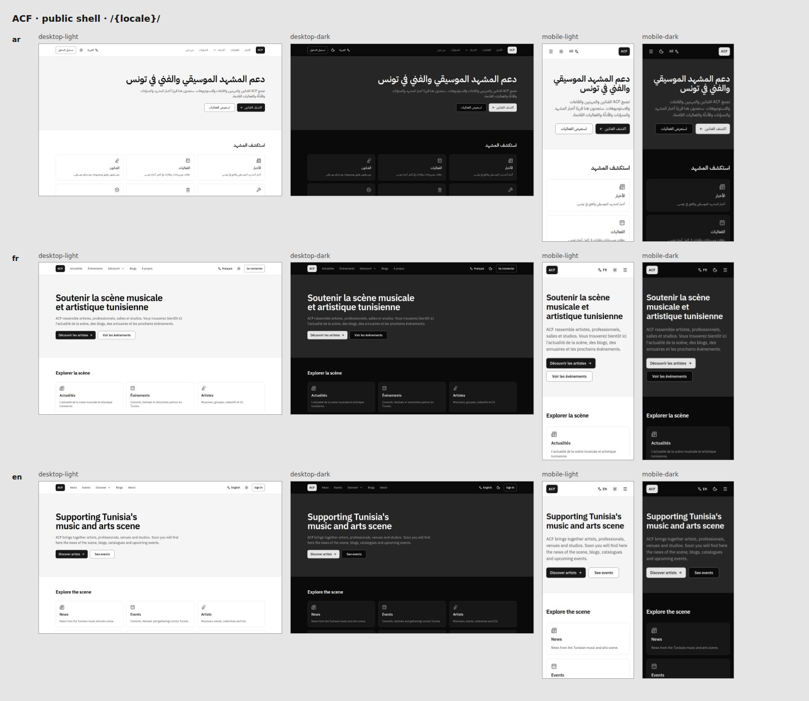

# ACF — website and association platform

Public website and internal platform of **ACF**, a cultural association supporting Tunisia's music
and arts scene. Trilingual — **Arabic (RTL), French and English** — with four access levels:

| Level | What it is |
|---|---|
| **Public** | News from the scene, blogs, catalogues of artists, professionals, venues and studios, events |
| **Members** (hidden) | Meetings and RSVP, tasks, announcements (incl. Discord), polls, volunteering, documents |
| **Board** (hidden) | Task assignment, finances, legal vault, correspondence with the supervising authority |
| **Admin** (hidden) | Users and roles, profile approvals, moderation, audit log, analytics, settings |

> **Status: phase 1 of 9 — foundation.** The trilingual, themed layout shell is in place with
> placeholder pages for every route; data, auth and real content arrive in the next phases
> ([roadmap](docs/roadmap.md)). Colours, fonts and logo are placeholders until ACF's graphic charter
> is added to `/brand` ([brand](docs/brand.md)).



More screenshots: [member](docs/screenshots/phase-1/member.jpg) ·
[board](docs/screenshots/phase-1/board.jpg) · [admin](docs/screenshots/phase-1/admin.jpg) ·
[mobile drawers](docs/screenshots/phase-1/drawers.jpg).

## Stack

[Next.js 16](https://nextjs.org) (App Router) · React 19 · TypeScript 6 (strict) · Tailwind CSS 4 ·
[shadcn/ui](https://ui.shadcn.com) on Radix · [next-intl](https://next-intl.dev) · Supabase (Postgres
+ RLS, Auth, Storage — from phase 2) · Vitest · Playwright + axe · deployed to **Cloudflare Workers**
with [OpenNext](https://opennext.js.org/cloudflare). Everything runs on free tiers.

## Getting started

Requirements: **Node.js 22** and npm.

```bash
npm install
cp .env.example .env.local   # optional in phase 1 — every variable has a safe default or is unused yet
npm run dev                  # http://localhost:3000 → redirects to /ar, /fr or /en
```

The hidden areas (`/member`, `/board`, `/admin`, `/account`) answer **404** until authentication
lands in phase 2. To review their layout locally:

```bash
ACF_PREVIEW_HIDDEN_AREAS=1 npm run dev   # development only — production builds always deny
```

## Scripts

| Command | What it does |
|---|---|
| `npm run dev` | Development server (Turbopack) |
| `npm run build` / `npm start` | Production build / serve it |
| `npm run lint` | ESLint, zero warnings allowed (also bans physical-direction classes and JSX text literals) |
| `npm run typecheck` | Generates route types, then `tsc --noEmit` |
| `npm run format` / `format:check` | Prettier (with Tailwind class sorting) |
| `npm test` | Vitest: unit tests, design-token contrast (WCAG AA), config ↔ message consistency |
| `npm run test:e2e` | Playwright on the production build: desktop + mobile, ar/fr/en, axe accessibility |
| `npm run i18n:check` | `messages/ar.json`, `fr.json`, `en.json` have identical keys and placeholders |
| `npm run screenshots` | Shell screenshots in every locale × theme × viewport → `docs/screenshots/phase-1/` |
| `npm run lighthouse` | Mobile Lighthouse on `/ar`, `/fr`, `/en` (needs `npm start` running); fails below 90 |
| `npm run cf:build` / `cf:size` | OpenNext Workers build / bundle size against the 3 MiB free limit |
| `npm run preview:cf` | Build and run the Worker locally in `workerd` |
| `npm run deploy:cf` | Build and deploy to Cloudflare (needs Wrangler credentials) |

Playwright uses its own Chromium (`npx playwright install chromium`), or the browser in
`PLAYWRIGHT_CHROMIUM_EXECUTABLE_PATH` if set.

## Project layout

```
messages/                 UI strings: ar.json · fr.json · en.json
src/
├── app/[locale]/         routes — (public) (auth) (account) (member) (board) (admin)
├── components/ui/        shadcn/ui primitives (restyled through tokens only)
├── components/layout/    header, footer, navigation, locale switcher, theme toggle, shells
├── config/               navigation and icons (single source for menus)
├── i18n/                 next-intl routing, request config, locale helpers
├── lib/                  guards, metadata, env, route factories, utilities
├── middleware.ts         locale negotiation (Edge runtime — see docs/decisions.md D-031)
└── styles/               token parsing used by the contrast test
tests/e2e/                Playwright specs · tests/screenshots/ screenshot matrix
docs/                     vision, roles, architecture, brand, roadmap, decisions, audit
```

## Conventions

Read [`CLAUDE.md`](CLAUDE.md) before contributing — it is the working agreement for humans and
Claude: coding standards, **i18n/RTL rules** (logical CSS only, every string in three languages),
**security rules** (RLS on every table, never trust client-side role checks) and the session
workflow (every change ends in a pull request and a [decisions](docs/decisions.md) entry).

| Doc | |
|---|---|
| [Vision](docs/vision.md) | What we are building and why |
| [Roles](docs/roles.md) | Permission matrix — source of truth for authorization |
| [Architecture](docs/architecture.md) | Routes, data model, auth, integrations, deployment |
| [Brand](docs/brand.md) | Design tokens and what the charter must provide |
| [Roadmap](docs/roadmap.md) | Phases 1–9 with acceptance criteria |
| [Decisions](docs/decisions.md) | Append-only decisions log |

## Deployment

The app is built for **Cloudflare Workers** (free plan) through OpenNext; CI checks that the Worker
stays under the 3 MiB compressed limit on every pull request. Deploys are opt-in: set the repository
variable `CLOUDFLARE_DEPLOY_ENABLED=true` and the secrets `CLOUDFLARE_API_TOKEN` and
`CLOUDFLARE_ACCOUNT_ID`; `main` then deploys to production and pull requests upload preview
versions ([`.github/workflows/deploy.yml`](.github/workflows/deploy.yml)).

## License

[MIT](LICENSE).
