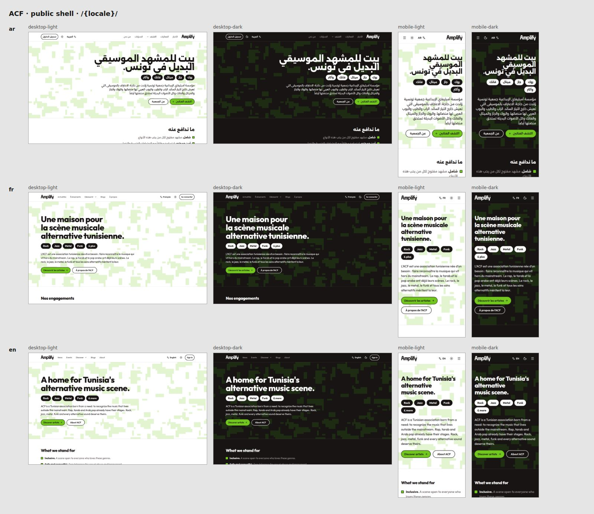

# Amplify Creative Foundation — website and association platform

Public website and internal platform of the **Amplify Creative Foundation (ACF)**, a Tunisian association
and *a home for Tunisia's alternative music scene*: rock, jazz, metal, funk and every sound outside the
mainstream. Trilingual — **French (default), Arabic (RTL) and English** — with four access levels:

| Level | What it is |
|---|---|
| **Public** | News from the scene, blogs, catalogues of artists, professionals, venues and studios, events |
| **Members** (hidden) | Meetings and RSVP, tasks, announcements (incl. Discord), polls, volunteering, documents |
| **Board** (hidden) | Task assignment, finances, legal vault, correspondence with the supervising authority |
| **Admin** (hidden) | Users and roles, profile approvals, moderation, audit log, analytics, settings |

> **Status: phase 2 of 9 done — data model, auth and RLS.** The trilingual site uses the charter in
> `/brand` in light and dark themes. The full database schema is in place with row-level security tested
> against the [permission matrix](docs/roles.md), and accounts work end to end (sign-up with email
> confirmation, password or magic-link sign-in, password reset). Public pages other than home and About
> are placeholders until phase 3 ([roadmap](docs/roadmap.md)).



More screenshots: [about](docs/screenshots/brand/about.jpg) · [member](docs/screenshots/brand/member.jpg) ·
[board](docs/screenshots/brand/board.jpg) · [admin](docs/screenshots/brand/admin.jpg) ·
[mobile drawers](docs/screenshots/brand/drawers.jpg) · phase 1 before the brand:
[`docs/screenshots/phase-1/`](docs/screenshots/phase-1/).

## Stack

[Next.js 16](https://nextjs.org) (App Router) · React 19 · TypeScript 6 (strict) · Tailwind CSS 4 ·
[shadcn/ui](https://ui.shadcn.com) on Radix · [next-intl](https://next-intl.dev) · Supabase (Postgres
+ RLS, Auth, Storage — from phase 2) · Vitest · Playwright + axe · hosted on **[Vercel](https://vercel.com)**.

## Getting started

Requirements: **Node.js 22**, npm and **Docker** (for the local Supabase stack).

```bash
npm install
npm run db:start             # Postgres, Auth, Storage and Mailpit in Docker; applies migrations + seed
npm run db:env               # writes the local Supabase URL and keys into .env.local
npm run dev                  # http://localhost:3000 → redirects to /fr (or /ar, /en from your browser language)
```

Sign in with a fictional demo account (password `demo-password-1`): `admin@acf.test`, `board@acf.test`,
`member@acf.test`, `artist@acf.test`, `venue@acf.test` or `registered@acf.test`. Emails sent by the app (confirmation,
magic links, password reset) land in Mailpit at http://127.0.0.1:54324.

Signed-out visitors to `/member`, `/board`, `/admin` and `/account` are sent to sign in; signed-in users without
the role get a 404. To look at the hidden shells without a database:

```bash
ACF_PREVIEW_HIDDEN_AREAS=1 npm run dev   # development only — production builds always deny
```

## Scripts

| Command | What it does |
|---|---|
| `npm run dev` | Development server (Turbopack) |
| `npm run build` / `npm start` | Production build / serve it |
| `npm run lint` | ESLint, zero warnings allowed (also bans physical-direction classes and JSX text literals) |
| `npm run typecheck` | Generates route types, then `tsc --noEmit` |
| `npm run format` / `format:check` | Prettier (with Tailwind class sorting) |
| `npm test` | Vitest: unit tests, design-token contrast (WCAG AA), config ↔ message consistency |
| `npm run test:e2e` | Playwright on the production build: desktop + mobile, ar/fr/en, axe accessibility |
| `npm run i18n:check` | `messages/ar.json`, `fr.json`, `en.json` have identical keys and placeholders |
| `npm run screenshots` | Screenshots in every locale × theme × viewport → `docs/screenshots/brand/` (override with `SCREENSHOT_DIR`) |
| `npm run lighthouse` | Mobile Lighthouse on `/ar`, `/fr`, `/en` (needs `npm start` running); fails below 90 |
| `npm run db:start` / `db:stop` / `db:reset` | Local Supabase stack; `db:reset` rebuilds it from migrations + seed |
| `npm run db:test` | pgTAP row-level-security suite + concurrency test |
| `npm run db:lint` | Database linter and Supabase security/performance advisors |
| `npm run db:types` / `db:env` | Regenerate `src/types/database.ts` / write local keys to `.env.local` |

Playwright uses its own Chromium (`npx playwright install chromium`), or the browser in
`PLAYWRIGHT_CHROMIUM_EXECUTABLE_PATH` if set.

## Project layout

```
messages/                 UI strings: ar.json · fr.json · en.json
src/
├── app/[locale]/         routes — (public) (auth) (account) (member) (board) (admin)
├── features/auth/        sign-up, sign-in, magic link, password reset (Server Actions, forms)
├── components/ui/        shadcn/ui primitives (restyled through tokens only)
├── components/brand/     charter motifs and one-pager sections (camo, genres, values, axes)
├── components/layout/    header, footer, navigation, locale switcher, theme toggle, logo, shells
├── config/               navigation and icons (single source for menus)
├── i18n/                 next-intl routing, request config, locale helpers
├── lib/                  guards, metadata, env, route factories, utilities
├── lib/supabase/         server, browser, public and service-role clients; session refresh
├── types/database.ts     generated from the schema (npm run db:types)
├── proxy.ts              locale negotiation (French by default) + Supabase session refresh
└── styles/               token parsing used by the contrast test
supabase/                 migrations, pgTAP tests, seed, auth email templates, config.toml
tests/e2e/                Playwright specs · tests/screenshots/ screenshot matrix
brand/                    ACF's graphic charter and one-pager (source of truth for the design)
public/brand/             logo masks cut from the charter
docs/                     vision, roles, architecture, brand, roadmap, decisions, audit
```

## Conventions

Read [`CLAUDE.md`](CLAUDE.md) before contributing — it is the working agreement for humans and
Claude: coding standards, **i18n/RTL rules** (logical CSS only, every string in three languages),
**security rules** (RLS on every table, never trust client-side role checks) and the session
workflow (every change ends in a pull request and a [decisions](docs/decisions.md) entry).

| Doc | |
|---|---|
| [Vision](docs/vision.md) | What we are building and why |
| [Roles](docs/roles.md) | Permission matrix — source of truth for authorization |
| [Architecture](docs/architecture.md) | Routes, data model, auth, integrations, deployment |
| [Brand](docs/brand.md) | The charter, design tokens, fonts and logo |
| [Roadmap](docs/roadmap.md) | Phases 1–9 with acceptance criteria |
| [Decisions](docs/decisions.md) | Append-only decisions log |

## Deployment

Hosted on **Vercel** with its Git integration: import the repository in Vercel (framework preset
Next.js, Node 22), and `main` deploys to production while every pull request gets a preview URL.
Set `NEXT_PUBLIC_SITE_URL` in the Vercel project's environment variables (see
[`.env.example`](.env.example)), plus `NEXT_PUBLIC_SUPABASE_URL` and `NEXT_PUBLIC_SUPABASE_PUBLISHABLE_KEY` in the
**Production** environment only; never commit secrets. The database is one hosted Supabase project (production);
development uses the local stack, and preview deployments run without a database. Migrations reach production
through the `db-migrate.yml` workflow after an approval. Details in
[architecture §10](docs/architecture.md#10-environments-and-free-tier-deployment-plan).

## License

[MIT](LICENSE).
