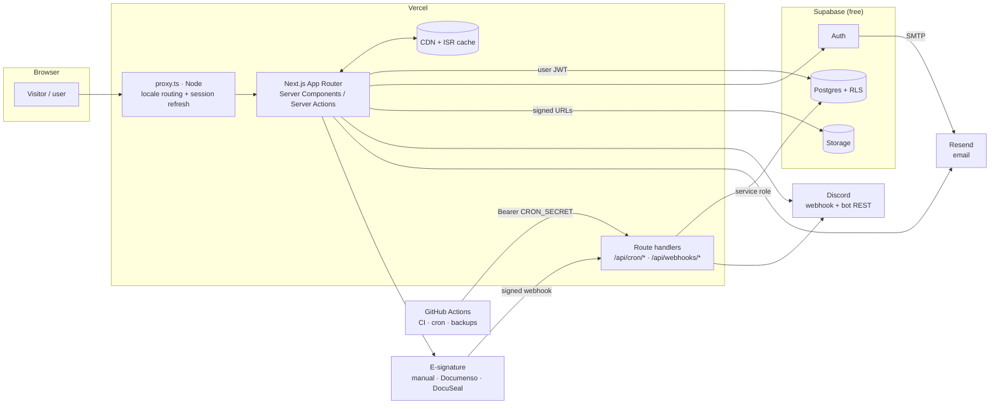
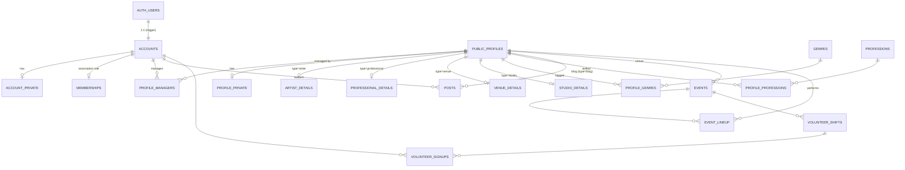
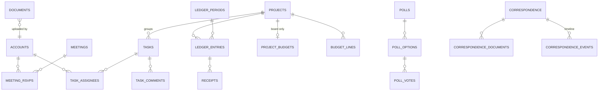
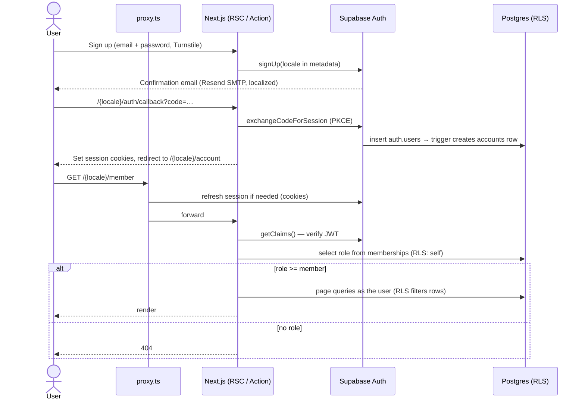

# Architecture

Status: **phase 2 implemented**. The migrations in `supabase/migrations/` are authoritative; §6–8 describe
them. Authorization
rules live in [`roles.md`](roles.md); this document describes how they are implemented.

## 1. Overview



Key idea: **the browser never talks to the database with more power than the signed-in user has.**
Server Components and Server Actions use the user's JWT, so Postgres RLS decides. The service-role key
is confined to the cron and webhook route handlers listed in [`roles.md`](roles.md#system-actor-service-role-allowed-uses).

## 2. Stack (pinned in phase 1)

| Concern | Choice | Version at planning time | Notes |
|---|---|---|---|
| Framework | Next.js App Router | 16.3.8 | Node `proxy.ts` (D-042), React Server Components |
| UI runtime | React | 19.x | |
| Language | TypeScript | **6.0.x** | 7.0 is out, but `typescript-eslint` supports `<6.1`; revisit later |
| Styling | Tailwind CSS v4 | 4.3.x | CSS-first `@theme`, logical properties for RTL |
| Components | shadcn/ui (CLI) | 4.21.x | Generated into `src/components/ui`, Radix primitives, RTL-aware |
| i18n | next-intl | 4.14.x | `[locale]` segment, `ar` (RTL), `fr`, `en` |
| Backend | Supabase: Postgres, Auth, Storage | `@supabase/supabase-js` 2.x, `@supabase/ssr` 0.12.x | Two free projects: **dev** and **prod** |
| Validation | Zod | 4.x | Shared between forms and server actions |
| Forms | React Hook Form + Zod resolver | | Server actions re-validate |
| Email | Resend + React Email | | Also Supabase Auth custom SMTP |
| Tests | Vitest (unit), Playwright (e2e), pgTAP via `supabase test db` (RLS) | | |
| Deploy | Vercel (Git integration) | — | See §10 (D-042) |
| Package manager | npm | 10.x | One lockfile (`package-lock.json`) |
| Node | 22 LTS | ≥ 20.9 required by Next 16 | |

## 3. Repository layout

```
.
├── CLAUDE.md                      Working agreement for humans and Claude
├── docs/                          vision, roles, architecture, brand, roadmap, decisions, audit
├── messages/                      ar.json · fr.json · en.json (UI strings, next-intl)
├── brand/                         ACF charter and one-pager (source of truth for docs/brand.md)
├── public/brand/                  logo masks cut from the charter
├── scripts/                       dev scripts (MCP wrappers, seed helpers)
├── supabase/
│   ├── config.toml
│   ├── migrations/                timestamped SQL, the only way the schema changes
│   ├── seed.sql                   dev/preview seed data (never prod personal data)
│   └── tests/                     pgTAP tests: RLS matrix, guard rails
├── src/
│   ├── app/
│   │   ├── [locale]/
│   │   │   ├── layout.tsx         <html lang dir>, fonts, providers
│   │   │   ├── (public)/          public site
│   │   │   ├── (auth)/            login, signup, reset, callback
│   │   │   ├── (account)/         any signed-in user: own account + public-profile onboarding
│   │   │   ├── (member)/member/   hidden: role ≥ member
│   │   │   ├── (board)/board/     hidden: role ≥ board
│   │   │   └── (admin)/admin/     hidden: role = admin
│   │   ├── api/
│   │   │   ├── cron/[job]/route.ts
│   │   │   └── webhooks/signature/[provider]/route.ts
│   │   ├── robots.ts · sitemap.ts · manifest.ts
│   ├── components/
│   │   ├── ui/                    shadcn/ui (hand-ported v4 source, D-028)
│   │   ├── brand/                 charter motifs and one-pager sections (camo, genres, values, axes)
│   │   └── layout/                header, footer, nav, locale switcher, theme toggle, logo, shells
│   ├── config/                    navigation.ts (every menu) · icons.ts
│   ├── proxy.ts                   next-intl locale negotiation (Node runtime, D-042)
│   ├── styles/                    token parsing for the contrast test
│   ├── features/<domain>/         profiles, events, posts, meetings, tasks, announcements,
│   │                              polls, volunteering, documents, finance, correspondence, admin
│   │   ├── components/            domain UI
│   │   ├── queries.ts             server-only reads
│   │   ├── actions.ts             'use server' mutations (validate → authorize → write)
│   │   └── schemas.ts             Zod schemas
│   ├── emails/                    React Email templates (localized)
│   ├── i18n/                      routing.ts · request.ts · navigation.ts
│   ├── lib/
│   │   ├── supabase/              server.ts · browser.ts · public.ts (no cookies) · admin.ts (service role, server-only)
│   │   ├── auth/                  guards.ts (requireUser, requireRole), roles.ts
│   │   └── …                      utils, formatting (money in millimes, dates in Africa/Tunis)
│   └── types/database.ts          generated: `supabase gen types typescript`
├── tests/e2e/                     Playwright
└── .github/workflows/             ci.yml · cron-*.yml · backup.yml · db-migrate.yml (deploys: Vercel Git integration)
```

## 4. Routing

All pages live under `[locale]` (`ar` | `fr` | `en`). Route groups (in parentheses) don't
change URLs. They give each access level its own layout, and the layout runs its guard.

| Group | URL prefix | Guard (server-side, in layout **and** in every action/handler) | Rendering |
|---|---|---|---|
| `(public)` | `/{locale}/…` | none | Static/ISR, public Supabase client without cookies, tag revalidation on publish |
| `(auth)` | `/{locale}/login`, `/signup`, `/forgot-password`, `/auth/callback` | redirect away if signed in | Dynamic |
| `(account)` | `/{locale}/account/…` | `requireUser()` | Dynamic |
| `(member)` | `/{locale}/member/…` | `requireRole('member')` | Dynamic, `noindex` |
| `(board)` | `/{locale}/board/…` | `requireRole('board')` | Dynamic, `noindex` |
| `(admin)` | `/{locale}/admin/…` | `requireRole('admin')` | Dynamic, `noindex` |

Guard behaviour (from phase 2; in phase 1 the stub guards always answer 404, with a development-only
preview via `ACF_PREVIEW_HIDDEN_AREAS=1`, D-035): not signed in → redirect to `/{locale}/login?next=…`. Signed in without the
required role → `notFound()`, so hidden areas don't reveal that they exist. `robots.ts` disallows
`/*/member`, `/*/board`, `/*/admin`, `/*/account`.

### URL map

| Area | Routes |
|---|---|
| Public | `/` home · `/news`, `/news/[slug]` · `/blogs`, `/blogs/[blog]`, `/blogs/[blog]/[slug]` · `/artists`, `/artists/[slug]` · `/professionals`, `/professionals/[slug]` · `/venues`, `/venues/[slug]` · `/studios`, `/studios/[slug]` · `/events`, `/events/[slug]` · `/about` · `/contact` · `/legal/privacy` · `/legal/terms` |
| Account | `/account` · `/account/settings` (name, locale, avatar, password, MFA) · `/account/profiles` · `/account/profiles/new?type=…` · `/account/profiles/[id]` (edit, submit, managers) · `/account/events/new` (approved artists/venues) · `/account/blog/posts…` (approved blog owners) |
| Member | `/member` (dashboard: next meetings, my tasks, latest announcements, open polls) · `/member/meetings`, `/member/meetings/[id]` · `/member/tasks` · `/member/announcements` · `/member/polls`, `/member/polls/[id]` · `/member/volunteer` · `/member/documents` · `/member/directory` |
| Board | `/board` · `/board/tasks` (create/assign) · `/board/meetings` (create) · `/board/announcements` (compose, push to Discord) · `/board/polls` · `/board/volunteering` · `/board/news` · `/board/events` (proposals, publish) · `/board/finance` (ledger) · `/board/finance/projects/[id]` (budgets) · `/board/finance/receipts` · `/board/finance/exports` · `/board/vault` · `/board/correspondence`, `/board/correspondence/[id]` |
| Admin | `/admin` (analytics) · `/admin/users` (roles, invitations) · `/admin/approvals` · `/admin/moderation` · `/admin/audit` · `/admin/settings` · `/admin/integrations` |
| API | `POST /api/cron/[job]` · `POST /api/webhooks/signature/[provider]` |

Slugs are Latin (transliterated) and shared across locales; `hreflang` alternates link the three
locale versions of each page.

## 5. Internationalization and RTL

- **next-intl** with `localePrefix: 'always'`. `/` negotiates from `Accept-Language` and a cookie,
  falling back to the default locale, **`fr`** (D-043).
- `<html lang={locale} dir={locale === 'ar' ? 'rtl' : 'ltr'}>` is set in `[locale]/layout.tsx`.
- **Formatting** uses `Intl` with `ar-TN`, `fr-TN` and `en`. Times display in `Africa/Tunis` (UTC+1, no
  DST). Money is stored as integer **millimes** (1 TND = 1000 millimes) and formatted with 3 decimals.
- **UI strings** live in `messages/{ar,fr,en}.json` with identical key sets, which CI checks. No
  hard-coded user-facing strings in components.
- **User content**:
  - Short translatable fields (profile tagline/bio, event title/description, taxonomy names) are
    `jsonb` locale maps: `{"ar": "…", "fr": "…", "en": "…"}`. At least one locale is required, and the
    display falls back from the requested locale to `fr`, then `ar`, then `en`, then any.
  - Long-form posts are **one row per language**, linked by `translation_group`, so each language
    version has its own slug, publish date and SEO.
- **RTL rules** (also in `CLAUDE.md`): logical Tailwind utilities only (`ms-*`, `me-*`, `ps-*`, `pe-*`,
  `start-*`, `end-*`, `text-start`, `border-s`), `rtl:` variants for icons that indicate direction
  (chevrons, arrows), never mirror logos or media, use `dir="auto"` on user-generated text, and test
  every screen in `ar`.
- **Fonts**: one Arabic and one Latin family (or a family covering both) loaded with `next/font`
  (self-hosted, no runtime Google requests). Choice is pending the charter, see [`brand.md`](brand.md).

## 6. Data model (draft)

Conventions: `uuid` primary keys (`gen_random_uuid()`); `created_at`/`updated_at timestamptz`
(trigger-maintained); `citext` for slugs and emails; money as `bigint` millimes; enums for closed
sets; soft delete (`deleted_at`) only where history matters (finance). **Every table has RLS
enabled.** Tables in `public` are reachable through the Data API, so RLS is the only barrier.
Helper functions live in a non-exposed `private` schema.

### Enums

| Enum | Values |
|---|---|
| `app_role` | `member`, `board`, `admin` |
| `membership_status` | `active`, `suspended`, `alumni` |
| `profile_type` | `artist`, `professional`, `venue`, `studio`, `blog` |
| `profile_status` | `draft`, `pending`, `approved`, `rejected`, `suspended` |
| `content_status` | `draft`, `pending`, `published`, `unpublished` |
| `post_kind` | `news`, `blog` |
| `task_status` | `todo`, `in_progress`, `blocked`, `done`, `cancelled` |
| `rsvp_response`, `poll_vote_value` | `yes`, `maybe`, `no` |
| `ledger_direction` | `income`, `expense` |
| `payment_method` | `cash`, `bank_transfer`, `cheque`, `card`, `other` |
| `correspondence_status` | `draft`, `sent`, `awaiting_signature`, `signed`, `archived` |
| `document_collection` | `library`, `legal` |
| `locale` | `ar`, `fr`, `en` |

`audience` columns (meetings, tasks, announcements, polls, documents) reuse `app_role` with
`check (audience in ('member', 'board'))`, so they compare directly with the caller's role in `private.has_role(audience)`.

### Entity overview





### Tables

**Identity and access**

| Table | Key columns | Notes |
|---|---|---|
| `accounts` | `id` (= `auth.users.id`), `display_name`, `avatar_path`, `preferred_locale`, `deactivated_at`, `deletion_requested_at` | Created by trigger on `auth.users` insert with the sign-up locale and name. Readable by self, members+ (directory), admin |
| `account_private` | `account_id`, `phone` | Self (R, U), board+ (R). Created with the account |
| `memberships` | `user_id` PK, `role app_role`, `status`, `joined_on`, `granted_by` | **One row per user**; hierarchy via rank. Only admin writes. Last-admin trigger |
| `invitations` | `email`, `role`, `token_hash`, `invited_by`, `expires_at`, `accepted_at` | Admin only. Membership attached on first sign-in with the matching *verified* email |

**Public profiles and catalogue**

| Table | Key columns | Notes |
|---|---|---|
| `public_profiles` | `type`, `slug` (unique), `status`, `display_name`, `tagline jsonb`, `bio jsonb`, `governorate_code`, `city`, `avatar_path`, `cover_path`, `links jsonb` (`[{kind,url}]`), `public_contact jsonb`, `submitted_at`, `approved_at`, `approved_by`, `search tsvector` (generated) | Anonymous users read `status='approved'` only |
| `profile_private` | `profile_id`, `contact_email`, `contact_phone` | Managers + admin |
| `profile_managers` | `profile_id`, `user_id`, `role` (`owner`/`editor`) | Created atomically with the profile by `create_profile()` RPC |
| `profile_claims` | `profile_id`, `user_id`, `message`, `status`, `reviewed_by` | **Not created yet**: only if ACF seeds unclaimed profiles (open question, D-050) |
| `artist_details` | `profile_id`, `kind` (`solo`/`band`/`collective`/`dj`), `formed_year` | |
| `professional_details` | `profile_id`, `years_experience`, `available_for_hire` | |
| `venue_details` | `profile_id`, `address`, `lat`, `lng`, `capacity`, `venue_kind`, `has_backline`, `accessibility jsonb` | Map link to OpenStreetMap (no API key) |
| `studio_details` | `profile_id`, `address`, `services text[]` (`recording`, `mixing`, `mastering`, `rehearsal`, `production`) | |
| `genres`, `professions` | `slug`, `name jsonb` | Admin-managed taxonomies. Genres are seeded from the 11 legacy genres |
| `profile_genres`, `profile_professions` | join tables | |
| `governorates` | `code` (ISO 3166-2:TN), `name jsonb` | 24 rows, seeded |

**Content**

| Table | Key columns | Notes |
|---|---|---|
| `posts` | `kind`, `blog_profile_id` (required when `kind='blog'`), `author_id`, `locale`, `translation_group`, `slug`, `title`, `excerpt`, `body_md`, `cover_path`, `status`, `published_at` | Markdown rendered server-side and sanitized. Unique `(kind, blog_profile_id, locale, slug)` |
| `events` | `slug`, `title jsonb`, `description jsonb`, `starts_at`, `ends_at`, `venue_profile_id` or `venue_text`, `governorate_code`, `cover_path`, `ticket_url`, `is_free`, `organized_by_acf`, `status`, `proposed_by`, `published_by` | Proposals by approved artists/venues; publishing by board |
| `event_lineup` | `event_id`, `profile_id`, `role`, `position` | |

**Member space**

| Table | Key columns | Notes |
|---|---|---|
| `meetings` | `title`, `description_md`, `starts_at`, `ends_at`, `location_text`, `online_url`, `audience`, `minutes_document_id`, `cancelled_at` | |
| `meeting_rsvps` | `meeting_id`, `user_id`, `response`, `note` | PK `(meeting_id, user_id)` |
| `tasks` | `title`, `description_md`, `status`, `priority`, `due_on`, `project_id`, `audience`, `is_open`, `created_by`, `completed_at` | `is_open` allows member self-assignment |
| `task_assignees` | `task_id`, `user_id`, `assigned_by` | |
| `task_comments` | `task_id`, `author_id`, `body_md` | |
| `announcements` | `source` (`board`/`discord`), `audience`, `title`, `body_md`, `author_id`, `author_display`, `discord_message_id` (unique), `discord_posted_message_id`, `pinned`, `published_at`, `edited_at`, `hidden_at` | One feed for board posts and Discord mirror |
| `polls` | `title`, `description_md`, `kind` (`availability`/`choice`), `multi`, `audience`, `closes_at` | |
| `poll_options` | `poll_id`, `label`, `starts_at`, `ends_at`, `position` | Time slots for availability polls |
| `poll_votes` | `option_id`, `user_id`, `value` | PK `(option_id, user_id)`; votes locked after `closes_at` |
| `volunteer_shifts` | `event_id`, `role_label jsonb`, `starts_at`, `ends_at`, `capacity` | |
| `volunteer_signups` | `shift_id`, `user_id`, `status` | Capacity enforced by trigger with row lock |
| `documents` | `collection` (`library`/`legal`), `audience`, `title`, `category`, `storage_path`, `mime_type`, `size_bytes`, `version`, `supersedes_id`, `uploaded_by`, `archived_at` | `legal` ⇒ audience `board` (check constraint) |

**Board space**

| Table | Key columns | Notes |
|---|---|---|
| `projects` | `name`, `status`, `starts_on`, `ends_on` | Members can read them (task context); the description lives in `project_budgets.notes` (board) |
| `project_budgets` | `project_id`, `total_planned_millimes`, `notes` | Board only (private columns split out of `projects`) |
| `budget_lines` | `project_id`, `category`, `label`, `planned_millimes` | |
| `ledger_periods` | `label`, `starts_on`, `ends_on`, `closed_at`, `closed_by` | Closed period ⇒ its entries are immutable |
| `ledger_entries` | `entry_date`, `direction`, `amount_millimes` (> 0), `category`, `project_id`, `budget_line_id`, `counterparty`, `payment_method`, `reference`, `description`, `period_id`, `reverses_entry_id`, `deleted_at` | Corrections by reversal entries; admin-only soft delete |
| `receipts` | `ledger_entry_id`, `storage_path`, `mime_type`, `size_bytes` | Files in the `board-vault` bucket |
| `correspondence` | `reference_code` (e.g. `ACF-2026-014`), `subject`, `direction`, `counterpart` (default the supervising authority), `counterpart_email`, `status`, `owner_id`, `due_on`, `sent_at`, `signed_at`, `archived_at`, `signature_provider`, `signature_request_id` | Status moves only through `transition_correspondence()` |
| `correspondence_documents` | `correspondence_id`, `kind` (`original`/`signed`/`attachment`/`reply`), `storage_path` | |
| `correspondence_events` | `correspondence_id`, `from_status`, `to_status`, `actor_id`, `note`, `email_message_id` | Immutable timeline |

**Platform and admin**

| Table | Key columns | Notes |
|---|---|---|
| `review_events` | `target_type` (`profile`/`event`/`post`), `target_id`, `action`, `actor_id`, `note_public` | Approval history, written by the workflow RPCs; admins, the board (events/posts) and the people concerned read it |
| `review_event_notes` | `review_event_id`, `note_internal` | Admin only (private column split out, Guard rail 3) |
| `moderation_reports` | `target_type`, `target_id`, `reason`, `details`, `reporter_id`, `status`, `resolved_by`, `resolution_note` | |
| `notifications` | `user_id`, `kind`, `payload jsonb`, `read_at` | In-app notifications |
| `notification_deliveries` | `kind`, `target_id`, `user_id`, `channel`, `sent_at` | Unique key makes cron jobs idempotent |
| `audit_log` | `id bigint identity`, `occurred_at`, `actor_id`, `actor_role`, `action`, `table_name`, `record_id`, `old_data`, `new_data` | Written only by `SECURITY DEFINER` triggers; admin read-only; no update/delete for anyone |
| `site_settings` | `key`, `value jsonb`, `is_public` | Anonymous users read `is_public` keys |
| `integration_state` | `key`, `value jsonb` | e.g. Discord sync cursor |

Audited tables (trigger → `audit_log`): `memberships`, `invitations`, `public_profiles` (status
changes), `events` (publish), `posts` (publish/unpublish), `ledger_entries`, `ledger_periods`,
`project_budgets`, `budget_lines`, `receipts`, `correspondence`, `documents`, `site_settings`.

### Storage buckets

| Bucket | Public | Path convention | Write | Read |
|---|---|---|---|---|
| `public-media` | yes | `profiles/{profile_id}/…`, `posts/{post_id}/…`, `events/{event_id}/…`, `site/…` | profile managers (own folder), board (posts/events), admin | anyone |
| `member-documents` | no | `library/{document_id}/{filename}` | board+ | members+ per `documents.audience` (policy joins `documents`) |
| `board-vault` | no | `legal/…`, `receipts/{entry_id}/…`, `correspondence/{id}/…` | board+ | board+ |

Private files are served through short-lived signed URLs (≈60 s) created server-side after an
authorization check. Uploads are limited by MIME type and size (images ≤ 5 MB, documents ≤ 20 MB). The free
tier's 1 GB of storage is tracked on the admin dashboard.

### Search

Postgres full-text search with the `simple` configuration plus `unaccent` and `pg_trgm` for fuzzy
matching across Arabic and Latin scripts, via a generated `search` column on `public_profiles` and
`events`. No external search service.

## 7. Security model

### Role checks in SQL

```sql
-- private schema is NOT exposed through the Data API
create function private.role_rank(r public.app_role) returns int
  language sql immutable
  as $$ select case r when 'member' then 1 when 'board' then 2 when 'admin' then 3 end $$;

create function private.has_role(min_role public.app_role) returns boolean
  language sql stable security definer set search_path = ''
  as $$
    select coalesce((
      select private.role_rank(m.role) >= private.role_rank(min_role)
      from public.memberships m
      where m.user_id = (select auth.uid()) and m.status = 'active'
    ), false)
  $$;

create function private.manages_profile(p uuid) returns boolean
  language sql stable security definer set search_path = ''
  as $$ select exists (select 1 from public.profile_managers
                       where profile_id = p and user_id = (select auth.uid())) $$;
```

### Policy patterns

```sql
alter table public.meetings enable row level security;

create policy "meetings: read by audience" on public.meetings
  for select to authenticated
  using (private.has_role(audience));

create policy "meetings: board manages" on public.meetings
  for all to authenticated
  using ((select private.has_role('board')))
  with check ((select private.has_role('board')));

create policy "profiles: public reads approved" on public.public_profiles
  for select to anon, authenticated
  using (status = 'approved');

create policy "profiles: managers read own" on public.public_profiles
  for select to authenticated
  using ((select private.manages_profile(id)));
```

### Privileges (D-049)

RLS decides which *rows*; grants decide which *operations and columns* exist. `20261004230800_grants.sql` revokes
everything from `anon`/`authenticated` and grants explicitly: `anon` may only `SELECT` the public catalogue
(taxonomies, profiles and their details, posts, events, line-ups, public settings); `authenticated` gets `SELECT`
everywhere except the delivery log, plus column-level `INSERT`/`UPDATE`. Status, `*_by`, `deactivated_at` and
`closed_at` columns are never granted. They change through these SECURITY DEFINER RPCs, each re-checking the caller:

| RPC | Who |
|---|---|
| `create_profile(type, slug, display_name)` / `submit_profile(id)` | any signed-in user / the profile's managers |
| `review_profile(id, approved\|rejected\|suspended\|reinstated, note_public, note_internal)` | admin |
| `set_post_status(id, status, note)` | board (news); managers of an approved blog; admin (unpublish only) |
| `propose_event(as_profile, …)` / `set_event_status(id, status, note)` | managers of an approved artist or venue / board |
| `set_task_status(id, status)` | assignees and board |
| `meeting_rsvp_counts(id)` / `volunteer_shift_counts(event)` | members (counts only) |
| `transition_correspondence(id, to_status, note)` | board forward, admin backward |
| `set_ledger_period_closed(id, closed)` / `set_account_deactivated(id, bool)` | admin |
| `request_account_deletion()` | any signed-in user (processing is a service-role job) |

Rules:
- **RLS on every table, no exceptions.** A pgTAP test fails CI if any table in `public` has
  `rowsecurity = false`, or has RLS enabled but no policies (unless it is explicitly listed as deny-all).
- Constant role checks are wrapped in `(select …)` so Postgres evaluates them once per statement.
- Privileged state changes (approve a profile, publish an event, move correspondence status, close a
  ledger period, grant a role) go through `SECURITY DEFINER` functions that re-check the caller,
  validate the transition, and write `audit_log`/`review_events` in the same transaction.
- `anon` gets `select` on public catalogue tables only. Default privileges are revoked for everything else.
- The **pgTAP RLS suite** (`supabase/tests/`) encodes [`roles.md`](roles.md): for each role
  (anonymous, registered, profile manager, member, board, admin) it asserts allowed and denied
  reads/writes on every table.

### Application layer

- Server Components and Server Actions create a Supabase client **from the request cookies**. All queries
  run as the user.
- Authorization helpers: `requireUser()` and `requireRole(min)` in `src/lib/auth/guards.ts`. They are
  called in hidden-area layouts **and at the top of every Server Action and route handler**, because
  Server Actions are public HTTP endpoints and layouts don't protect them. These checks give early, clear
  errors; **RLS is the real enforcement**.
- On the server, identity comes from `supabase.auth.getClaims()` (verifies the JWT) or `getUser()`,
  **never** from `getSession()` or anything client-supplied.
- `src/lib/supabase/admin.ts` (service role) imports `server-only` and may be imported only from
  `src/app/api/cron/**`, `src/app/api/webhooks/**` and the account-deletion action. An ESLint
  `no-restricted-imports` rule enforces this.
- Security headers via `next.config.ts`: CSP (nonces for scripts), `frame-ancestors 'none'`,
  `Referrer-Policy: strict-origin-when-cross-origin`, `Permissions-Policy`. Embeds (YouTube, Spotify,
  SoundCloud, Bandcamp) are click-to-load and allow-listed in `frame-src`.
- Bot protection: Cloudflare Turnstile (free) on sign-up, login, password reset (natively supported
  by Supabase Auth) and on report forms.
- Uploaded Markdown and HTML are sanitized on render. User links get `rel="nofollow ugc noopener"`.

## 8. Authentication flows



- **Methods:** email + password and email magic link/OTP. Google OAuth is optional (open question).
  Email confirmation is required.
- **Session:** `@supabase/ssr` cookies. `proxy.ts` runs the next-intl middleware, then refreshes the session
  (`getClaims()`) only when an `sb-*` cookie is present, so anonymous requests to static pages cost nothing (D-056).

### Admin bootstrap

The first admin can't be granted through the app (only admins grant roles). After the person has signed up and
confirmed their email on the production site, a project owner runs once, in the Supabase SQL editor:

```sql
insert into public.memberships (user_id, role)
select id, 'admin' from auth.users where email = 'first.admin@example.org';
```

The statement runs as the table owner (RLS doesn't apply) and is recorded in `audit_log` with no actor. From then on,
admins grant roles from `/admin/users` (phase 7), and the last-admin trigger keeps at least one active admin. Locally
the seed makes `admin@acf.test` the admin.
- **Email links:** every template in `supabase/templates/` (confirmation, magic link, recovery, email change) links to
  `/{locale}/auth/confirm?token_hash=…&type=…`. That route handler verifies the token server-side (`verifyOtp`), which
  sets the session cookies, then redirects: recovery → `/reset-password`, magic link → the page that asked for it,
  otherwise `/account`. The language follows the sign-up locale stored in user metadata (D-051).
- **No account enumeration:** sign-up, magic link and password reset always answer "check your email".
- **Association access:** a user signs up normally. The admin then grants a role from `/admin/users`,
  or sends an invitation that attaches the role when the invited email signs in for the first time.
  There is no self-service path to a role.
- **Public-profile onboarding** (any signed-in user):
  1. `/account/profiles/new?type=artist` → `create_profile()` RPC inserts the profile (`draft`) and the
     owner row in `profile_managers` atomically.
  2. Owner completes the type-specific form (validated by Zod on the client and again in the action) → `submit_profile()` → `pending`; the admin gets an email and an in-app notification.
  3. Admin approves/rejects in `/admin/approvals` (`review_profile()`) → `review_events` row, email to
     the managers, cache tag revalidated → the profile appears in the catalogue.
- **MFA:** TOTP enrollment in `/account/settings`. Requiring it (`aal2`) for board/admin data is
  planned and pending a decision.
- **Account deletion:** self-service request → server action anonymizes the `accounts` row, removes
  profile manager links (orphaned profiles go back to the admin), and deletes the auth user with the
  service role. Finance and correspondence history keep the anonymized actor id.

## 9. Integrations

### Email: Resend
- One provider for both **Supabase Auth emails** (custom SMTP, which lifts the built-in SMTP's very low
  rate limit) and **app emails** (Resend HTTP API).
- Templates in `src/emails/` (React Email), rendered in the recipient's `preferred_locale`; the
  Arabic version is `dir="rtl"`.
- Requires a domain with SPF/DKIM records (open question: ACF domain).
- Free-tier cap (about 100 emails/day and 3,000/month at planning time; verify): reminders are batched, and
  daily digests replace per-event emails when volume grows. Fallback provider: Brevo.

### Discord
- **Outbound (webhooks):** when the board publishes an announcement with "also post to Discord", the
  server action POSTs to the channel webhook (`?wait=true` returns the message id, stored in
  `announcements.discord_posted_message_id` so the inbound sync skips it). `allowed_mentions` is
  empty, so a post never pings `@everyone` by accident. Content over 2,000 characters is truncated
  and links back to the site. An optional second webhook announces newly published public events.
- **Inbound (scheduled REST fetch):** a bot application (no gateway connection needed) with *View
  Channel* and *Read Message History* on the announcements channel, and the *Message Content*
  privileged intent enabled (allowed without verification for bots in under 100 servers). Every 15
  minutes the cron job calls `GET /channels/{id}/messages?after={cursor}&limit=100` and upserts
  `announcements(source='discord')` keyed on `discord_message_id`. It also re-reads the latest 50
  messages to pick up edits and deletions, then stores the cursor in `integration_state`. It honours `429 retry_after`.
- Discord CDN attachment URLs expire, so v1 renders text plus a "view on Discord" link. Copying
  images into Storage is a later option.

### E-signature: Documenso or DocuSeal
- At planning time, **neither provider's free cloud plan includes API access.** The integration is
  therefore built behind a `SignatureProvider` interface:
  - `manual` (default, works on day one): the board emails the document from the tracker, then
    uploads the signed scan and moves the status by hand.
  - `documenso` / `docuseal` adapters: create request → signing link → webhook on completion →
    the signed PDF is fetched into `board-vault` and the status moves to `signed`. These require a
    self-hosted instance or a paid plan (open question).
- The webhook endpoint `/api/webhooks/signature/[provider]` verifies the provider's signature or shared
  secret before doing anything, and is idempotent.
- The supervising authority may require a qualified electronic signature (TunTrust/ANCE) or a wet
  signature and stamp. The manual path must stay first-class (open question).

### Scheduled jobs: GitHub Actions
Workflows call `POST {SITE_URL}/api/cron/{job}` with `Authorization: Bearer $CRON_SECRET` (compared in
constant time). Each job is idempotent (`notification_deliveries` unique keys) and returns a JSON summary.

| Workflow | Schedule (UTC; Tunis = UTC+1) | Jobs |
|---|---|---|
| `cron-frequent.yml` | `*/15 * * * *` | `discord-sync`, `reminders` (meetings at T-24h and T-2h, volunteer shifts at T-24h) |
| `cron-daily.yml` | `0 6 * * *` (07:00 Tunis) | `daily`: pending-approval digest to admin, tasks due soon, polls closing, overdue correspondence |
| `backup.yml` | `30 1 * * *` | `supabase db dump` (roles, schema, data) → encrypted with `age` → uploaded as a 30-day artifact (or to a private R2 bucket). Never stored unencrypted |

Caveats: GitHub may delay scheduled runs, so jobs work on time windows, not exact minutes. Public
repos disable schedules after 60 days without activity (the admin dashboard shows the last
successful run of each job). The 15-minute job also keeps the free Supabase project from pausing
after 7 days of inactivity. Fallbacks: Supabase `pg_cron`, or Vercel Cron (Hobby allows daily schedules only).

### Analytics
- **Operational metrics** come from SQL views on the admin dashboard: profiles by status/type,
  sign-ups per week, events per month, RSVP and volunteer rates, storage usage, cron health.
- **Traffic**: Vercel Web Analytics (cookieless, so no consent banner; the Hobby plan caps monthly
  events, verify) or Cloudflare Web Analytics (free, cookieless, works with any host).

## 10. Environments and free-tier deployment plan

| Environment | App | Database | Trigger |
|---|---|---|---|
| Local | `npm run dev` | Local Supabase stack (`npm run db:start`, Docker), seeded | — |
| Preview | Per-PR preview deployment | Supabase **dev** project | PR opened/updated |
| Production | Vercel (`main`) | Supabase **prod** project | Merge to `main` |

**Hosting: Vercel** (D-042), connected to the GitHub repository through Vercel's Git integration:
`main` deploys to production and every pull request gets a preview URL. No deploy workflow or token
lives in this repository. Pages are prerendered at build and served from Vercel's CDN; phase 3 adds
on-demand revalidation by cache tag when content is published.

Vercel project settings (done once in the dashboard, never in git):
- Framework preset Next.js, Node 22, install `npm ci`, build `npm run build`.
- Environment variables per environment (Production / Preview / Development), starting with
  `NEXT_PUBLIC_SITE_URL`; the Supabase, Resend, Discord and cron variables are added in their phases.
  Preview points at the Supabase **dev** project, Production at **prod**.
- Functions region next to the Supabase project's region (for example `fra1` for Supabase
  `eu-central-1`), so server-side queries don't cross the Atlantic. The default is `iad1` (US East).

**Supabase project settings** (dev and prod, once, in the dashboard; schema changes still only by migration):
- Auth → URL configuration: Site URL = `NEXT_PUBLIC_SITE_URL`; redirect URLs `https://<domain>/**` (and the Vercel
  preview pattern on **dev** only).
- Auth → Email templates: paste the four files from `supabase/templates/` (subjects in `config.toml`).
- Auth → Providers → Email: confirm email on; minimum password length 8 with letters and digits.
- Auth → SMTP: Resend (phase 2 input), otherwise Supabase's built-in sender is limited to a few emails per hour.
- Auth → Bot protection: Turnstile secret, and `NEXT_PUBLIC_TURNSTILE_SITE_KEY` in Vercel.
- Apply migrations with `supabase db push` (never the seed).

**Plan.** Vercel Hobby is free but limited to personal, non-commercial use: an association's
informational site fits; selling tickets, memberships or services on the site would require Pro.
Which plan ACF uses is an open question.

| Limit (free tier, verify at implementation) | Risk | Mitigation |
|---|---|---|
| Vercel Hobby: non-commercial use only | Paid features (ticketing, paid memberships) | Link out to third-party ticketing; move to Pro before selling anything |
| Vercel Hobby: monthly caps on data transfer, function invocations and CPU (about 100 GB transfer and 1M invocations at planning time) | Traffic spikes, heavy private pages | Public pages are static; images resized at upload; usage visible in the dashboard |
| Vercel Hobby: cron jobs run at most once a day | Frequent jobs | Scheduling stays on GitHub Actions (§9) |
| Supabase: 500 MB database, 1 GB storage, 5 GB egress, 50k MAU, 2 projects | Media growth | Image size limits, `next/image`-style resizing at upload, storage usage on the dashboard |
| Supabase: pauses after 7 days idle; **no backups** on free | Outage, data loss | 15-minute cron traffic; nightly encrypted `pg_dump` |
| Resend: about 100/day, 3,000/month | Reminder bursts | Digests, batching, Brevo fallback |
| GitHub Actions: free on public repos (2,000 min/month if private) | Repo made private | Keep CI lean, cache npm |

### CI/CD (GitHub Actions)
- `ci.yml` on every PR and on `main` (**in place since phase 1**): install → lint → typecheck →
  format check → message-key parity → unit tests (incl. token contrast) → build → Playwright e2e
  (desktop + mobile, three locales, axe, auth journeys). Since phase 2 it first starts the local Supabase stack and
  runs `db:lint` (linter + advisors), `db:test` (pgTAP + concurrency) and a stale-types check (D-055).
- Deployments are not a workflow: Vercel builds `main` and every pull request itself and reports the
  preview URL on the PR.
- `db-migrate.yml`: applies `supabase/migrations` to **dev** automatically on merge, and to **prod**
  only after manual approval (GitHub Environment `production` with required reviewer).

### Configuration (`.env.example` in phase 1)

| Variable | Scope | Purpose |
|---|---|---|
| `NEXT_PUBLIC_SITE_URL` | public | Canonical URLs, email links |
| `NEXT_PUBLIC_SUPABASE_URL`, `NEXT_PUBLIC_SUPABASE_PUBLISHABLE_KEY` | public | Browser/server client (RLS applies) |
| `SUPABASE_SECRET_KEY` | **server only** | Service role, only for cron/webhooks/account deletion |
| `RESEND_API_KEY`, `EMAIL_FROM` | server | Transactional email |
| `DISCORD_BOT_TOKEN`, `DISCORD_ANNOUNCEMENTS_CHANNEL_ID`, `DISCORD_WEBHOOK_URL_ANNOUNCEMENTS`, `DISCORD_WEBHOOK_URL_EVENTS` | server | Discord sync |
| `CRON_SECRET` | server + GitHub secret | Authenticates cron calls |
| `SIGNATURE_PROVIDER` (`manual`/`documenso`/`docuseal`), `SIGNATURE_API_URL`, `SIGNATURE_API_KEY`, `SIGNATURE_WEBHOOK_SECRET` | server | E-signature |
| `NEXT_PUBLIC_TURNSTILE_SITE_KEY` (public), `TURNSTILE_SECRET_KEY` | mixed | Bot protection |
| `BACKUP_AGE_RECIPIENT` | GitHub secret | Public key for encrypting backups |
| `SUPABASE_ACCESS_TOKEN`, `SUPABASE_DEV_PROJECT_REF` | developer machine / Claude env only | Supabase MCP server (dev project) |

## 11. Risks and open technical questions

1. **Hosting plan.** Vercel Hobby forbids commercial use (D-042). Fine for the current scope; re-check
   before any payment feature. Cache Components (`cacheComponents`) are not enabled yet.
2. **Function region.** Must match the Supabase region once the projects exist (§10).
3. **404 rendering.** Next 16.3 renders `notFound()` pages on the client from a recovery shell (D-036).
4. **Arabic search quality** with `simple` FTS. Acceptable for names. Revisit if content search matters.
5. **Legal validity of e-signatures** for the supervising authority (see open questions).
6. **Personal data** (Tunisian data protection law, INPDP): privacy policy, consent for seeded
   profiles, retention of member data, location of hosting (EU regions). To be reviewed in phase 9.
